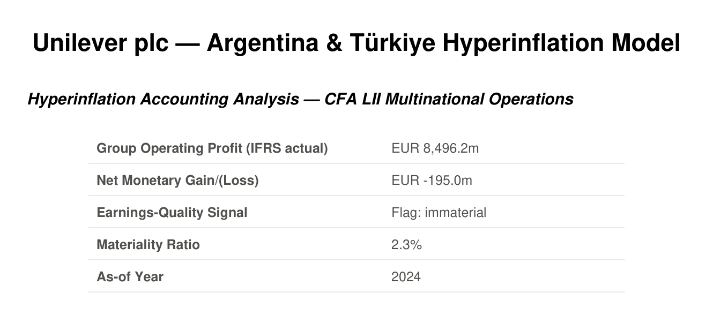
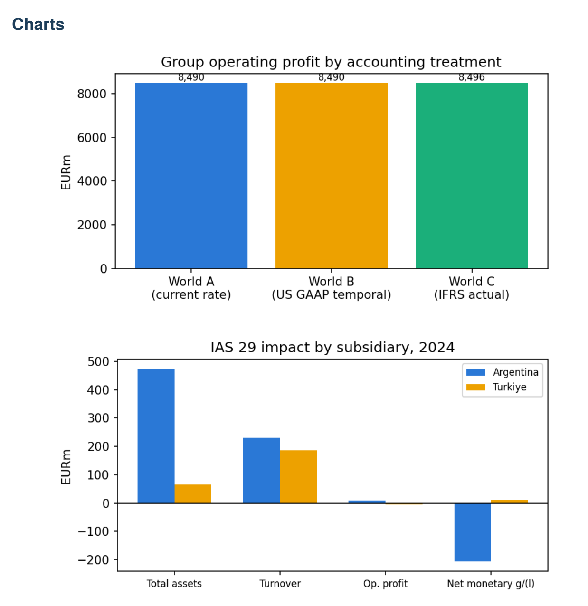

# Unilever Hyperinflation-Accounting Model

A CFA Level II Financial Statement Analysis teaching model — the *Multinational
Operations* reading, specifically hyperinflation accounting (IAS 29) and its interaction
with IAS 21 currency translation — illustrated with **Unilever plc**'s real disclosed
treatment of its Argentina and Türkiye subsidiaries. Produces an audit-ready, fully
formula-linked Excel workbook showing the whole restatement chain — local financial
statements → inflation-index restatement → FX translation → parent consolidation → ratio
analysis — under three parallel accounting treatments (plain current-rate, US GAAP
temporal, actual IFRS), calibrated to reproduce Unilever's own real disclosed figures.

Every calculated cell in the generated workbook is a live Excel formula — nothing is a
pasted-in number except the real disclosed facts and this model's own solved
local-currency inputs (see "Calibration" below for what that means).

<p align="center">
  
  &nbsp;&nbsp;
  
</p>
<p align="center"><em>The generated equity research report's cover page and chart page — see <a href="examples/2026-09-27_222102/">examples/2026-09-27_222102/</a> for the full workbook, PDF, and every intermediate research file from a real live run.</em></p>

## What this demonstrates

- **Technical accounting depth**: a working, hand-traceable implementation of IAS 29
  restatement + IAS 21 translation, contrasted against the US GAAP temporal method —
  calibrated to reproduce a real multinational's own disclosed figures, not a textbook
  toy example. Includes a documented, non-obvious finding (`research_output.md`'s "A
  finding worth flagging") about where the standard CFA-curriculum heuristic for net
  monetary gain/loss breaks down in a full consolidated model.
- **Live formula-linked Excel engineering**: every cell in the generated workbook is a
  real formula (openpyxl), independently verified against the Python engine with the
  `formulas` package (an actual Excel-formula evaluator) — not a value dump.
- **An automated multi-agent research/drafting/QA pipeline**: a 7-stage pipeline where
  live web research, section drafting, and a review-and-fix coherence gate all ran for
  real, twice (`BACKLOG.md` Phases 4 and 7) — the gate caught and fixed 8 genuine
  cross-section errors on its first run, including one subtle enough that it
  independently rediscovered a nuance already documented in this repo's own research
  notes; the second run used its full 10-iteration budget catching real issues as more
  cited material (peer companies, a standard-setting note) entered the mix.
- **Engineering rigor**: 51 automated tests (`pytest` unit tests + `pytest-bdd` Gherkin
  specs) covering the calculation engine, config validation, and report generation,
  running in CI (`.github/workflows/tests.yml`) on every push.
- **Git hygiene**: a clean, force-pushed history with personal-data and third-party
  content removed via `git-filter-repo` before this repo went public.

## Quick start

Prerequisites: Python 3 (any recent 3.x). Nothing else needs to be installed manually.

```bash
# Unix / macOS / Linux
./scripts/launch.sh

# Windows (Command Prompt)
scripts\launch.bat

# Windows (PowerShell)
.\scripts\launch.ps1
```

Any of the three launchers will, in order:
1. Create a `.venv` at the repo root if one doesn't already exist.
2. Install the runtime dependencies (`openpyxl`, `reportlab`, `matplotlib`) into it.
3. Build the model and write it to a timestamped folder under `output/`.

All three also load a repo-root `.env` file automatically, if one exists (copy
`.env.example` to `.env` to set up — see "Equity Research Report" below for what goes in
it). A variable already set in your shell before invoking the launcher wins over `.env`'s
value.

If you already have the venv active, you can run the entry point directly:

```bash
.venv/bin/python scripts/build_unilever_model.py
.venv/bin/python scripts/build_unilever_model.py --config path/to/config.py
```

## Equity Research Report (optional — `REPORT=1`)

**By default, the launchers only build the Excel model.** To also generate a
Morningstar-style report focused on the market-perception angle (does analyst consensus
correctly distinguish the IAS 29 effect from ordinary FX translation? — see `AGENTS.md`
for the pipeline's 7 stages), set `REPORT=1`, either inline:

```bash
REPORT=1 ./scripts/launch.sh unilever
```

or once, persistently, via a repo-root `.env` file (copy `.env.example` to `.env` and set
`REPORT=1` there). This makes several `claude -p` calls (subscription-billed, not a
separately metered API) and takes noticeably longer than the Excel-only path.

The pipeline was adapted from its prior REIT-model domain on 2026-09-27 (see
`BACKLOG.md` Phase 3), then run live end-to-end twice the same day (Phases 4 and 7) —
every stage, deterministic and `claude -p`-driven alike, has real output to show for it.
See `examples/2026-09-27_222102/` for the latest full checked-in run.

## Expected output

Each run creates `output/<YYYY-MM-DD_HHMMSS>/` containing:
- `<Prefix>_Financial_Model.xlsx` — the generated workbook.
- `config.py` — an exact copy of the config that produced it.

Every run is a reproducible snapshot this way. **Never hand-edit files inside `output/`**
— they're regenerated on every run; make changes in
`examples/<institution>/config.py` instead. Running `build_unilever_model.py` directly
without a launcher (no `OUTPUT_DIR` set) falls back to writing straight into
`examples/<institution>/`.

## What's in the workbook

Eight sheets, in tab order:

| Sheet | Contents |
|---|---|
| **Cover** | Title, scope, methodology summary (World A/B/C explained) |
| **Assumptions** | Every local-currency input the model uses, per subsidiary per year, color-coded by data provenance |
| **Argentina_Schedules**, **Turkiye_Schedules** | The core, one full restatement chain per subsidiary: 01 Local FS → 02 Inflation Index → 03 IAS 29 Restatement → 04 FX Translation (World C) → World A (plain current rate) → World B (US GAAP temporal) → IAS 29 Impact vs. Unilever's own disclosure |
| **Consolidation** | World C (actual IFRS) group totals combining both subsidiaries + the rest of the group, plus ROA/asset turnover |
| **Scenario_Comparison** | World A / B / C shown **side by side**, both years — the direct comparison the model is built around |
| **Validation_2025** | Model output vs. Unilever's real 2025 disclosure, per subsidiary, with the gap stated plainly |
| **Sources** | Citations (SEC EDGAR filings, IAS 29/IAS 21 references) |

Every subsidiary schedule cell is a live formula chaining back to Assumptions —
click through any figure to see exactly how it was derived, the same "traceable by hand"
principle the model was designed around.

## Interactive demo (no Excel needed)

```bash
.venv/bin/python scripts/build_interactive_demo.py
open docs/demo/index.html   # or just double-click it
```

A single self-contained HTML page — no server, no external scripts, works offline —
letting you toggle between World A/B/C and watch the consolidated Revenue/Operating
Profit/Total Assets/Net Monetary Gain-or-Loss move, plus the per-subsidiary IAS 29
impact table. The data is generated fresh from the real calculation engine every time
the script runs, not hand-typed — regenerate it any time `examples/unilever/config.py`
changes.

## Calibration — what's real and what's illustrative

Unilever discloses the *aggregate* IAS 29 impact (Total assets/Turnover/Operating
profit/Net monetary gain-loss) each year but not subsidiary-level financial statements at
the granularity needed to reconstruct the restatement. So this model builds a small,
fully hand-traceable **fictional** subsidiary for Argentina and for Türkiye, algebraically
solved so the model reproduces the **real 2024** disclosed figures almost exactly, then
rolled forward (not re-solved) into **2025** as an honest out-of-sample check — see
`examples/unilever/research_output.md` for the full derivation, citations, and a frank
discussion of where the 2025 roll-forward does and doesn't match. Only the aggregate
impact figures per subsidiary per year are real Unilever disclosures; the subsidiary-level
line items (revenue, PPE, monetary position, etc.) are this model's own illustration.

## Running the tests

```bash
.venv/bin/pip install -r requirements-dev.txt
.venv/bin/python -m pytest
```

51 tests: 36 unit tests covering the calculation engine (World A/B/C math, the
monetary-gain/loss balancing-plug identity, a regression test that the model still
reproduces Unilever's real disclosed 2024 figures), the config schema validator, and
the pure-Python report stages, plus 15 `pytest-bdd` scenarios (`tests/features/*.feature`)
expressing the calibration-fidelity and report-generation behavior in Gherkin. Neither
suite touches the `claude -p`-driven pipeline stages.

## Project structure

```
unilever_hyperinflation/
├── BLUEPRINT.md, BACKLOG.md, CHANGELOG.md, CLAUDE.md, AGENTS.md  ← tracking docs (repo root)
├── .venv/                                               ← shared virtual environment
├── .devops/agents/
│   └── equity-report/              ← SOPs for each equity-report pipeline stage
├── bizplan/
│   ├── config_loader.py            ← load_and_validate() / validate_config()
│   ├── financial/
│   │   ├── xl_helpers.py                      ← formula-capable openpyxl primitives
│   │   ├── hyperinflation_calculations.py     ← World A/B/C engine, Python ground truth
│   │   └── hyperinflation_excel_renderer.py   ← builds the live-formula workbook
│   └── report/                     ← the equity-research-report engine
│       ├── data.py, validation.py, recommendation.py, pdf.py   ← pure Python, no LLM
│       ├── claude_cli.py           ← shared `claude -p` invocation helper
│       └── sourcing.py, price_research.py, drafting.py, review.py, pipeline.py
├── examples/
│   ├── unilever/
│   │   ├── config.py               ← single source of truth for assumptions
│   │   └── research_output.md     ← calibration derivation, sourced and dated
│   └── 2026-09-27_222102/          ← a full checked-in sample of a live pipeline run
├── docs/
│   ├── demo/index.html             ← interactive World A/B/C demo (generated, see below)
│   └── screenshots/                ← images embedded in this README
├── tests/                           ← pytest unit tests + pytest-bdd feature specs
├── .github/workflows/tests.yml     ← CI: runs the test suite + a model build on every push
├── output/                                              ← gitignored; timestamped run folders
└── scripts/                         ← thin CLI wrappers only — logic lives in bizplan/
    ├── build_unilever_model.py     ← entry point: --instance/--config → calc → render → save
    ├── build_interactive_demo.py   ← generates docs/demo/index.html from the real model
    ├── source_model.py, research_price_consensus.py, draft_report_sections.py,
    │   review_report.py, build_report_pdf.py, generate_equity_report.py, refresh_report.py
    ├── launch.sh                   ← Unix/macOS/Linux launcher
    ├── launch.bat, launch.ps1      ← Windows launchers
    └── requirements.txt            ← runtime deps (openpyxl, reportlab, matplotlib)
```

## Where to go next

- **`BLUEPRINT.md`** — the design source of truth: the real-world case, the calculation
  engine's mechanics, the Excel renderer's structure, and known simplifications.
- **`BACKLOG.md`** — phase-by-phase status and what's next (including the deferred
  BBVA/Garanti "advanced case").
- **`CHANGELOG.md`** — what has actually landed, in order.
- **`examples/unilever/research_output.md`** — the full calibration derivation and
  citations; read this before treating any subsidiary-level figure as a real disclosure.
